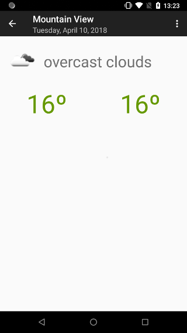
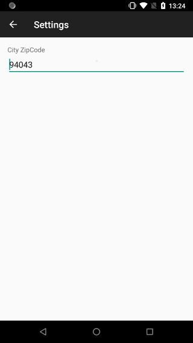

# twinterview The project code - TW

## The app requirements:

### General information: 
The app downloads wheather data from wheather service - http://api.openweathermap.org/data/2.5/forecast/daily?mode=json&units=metric&cnt=7&APPID=15646a06818f61f7b8d7823ca833e1ce&zip=94043 
It provides data for next 7 days including current day. 
Icon resource: http://openweathermap.org/img/w/#icon.png - for example http://openweathermap.org/img/w/04n.png - #icon is in json 
Downloaded wheather data should be persisted 
Zip code is hardcoded and if you create settings screen should be stored somewhere 

## There are 3 screens within the app.

### Main Screen:
TW-1. There is a list with wheather information items for next 7 days - zip code can be hardcoded 
TW-2. Each item contains icon - state of wheather,  day description in format MM DD, YYYY, whether desciption, max temperature, min temperature 
TW-3. The app contains toolbar with title: name (country) - Mountain View (US) - according to screen shot 
TW-4. Tapping on wheather item, the user is forwarded to Details Screen 
TW-5. The app contains toolbar with menu with Settings item. 
TW-6. Tapping on Settings item, the user is forwared to Settings screen 

### Details Screen - screen shot details.png: 
TW-7. The screen contains toolbar with title: name, day in format: Day, Month, DD, YYYY - according to screen shot 
TW-8. The toolbar contains <- navigation icon 
TW-9. Details screen contains: icon, whether description, max temperature, min temperature 

### Settings screen - screen shot settings.png: 
TW-10. The sceen contains toolbar with title: Settings and back icon <- 
TW-11 Settings screen contains: City ZipCode, EditText with hint City ZipCode, accepting only Numbers - zip code is changing in settings screen 

